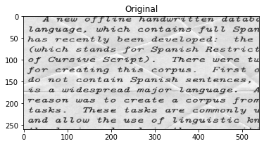
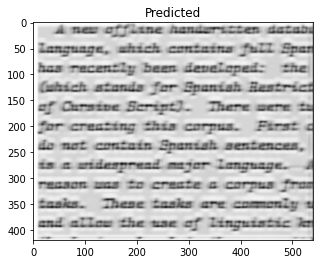

# Denoising_dirty_documents

Optical Character Recognition (OCR) is the process of getting type or handwritten documents into a digitized format. If you've read a classic novel on a digital reading device or had your doctor pull up old healthcare records via the hospital computer system, you've probably benefited from OCR.

OCR makes previously static content editable, searchable, and much easier to share. But, a lot of documents eager for digitization are being held back. Coffee stains, faded sun spots, dog-eared pages, and lot of wrinkles are keeping some printed documents offline and in the past. 

The dataset can be find here: [Kaggle](https://www.kaggle.com/c/denoising-dirty-documents/data)

In this project, the dataset images consists of various styles of text, to which synthetic noise has been added to simulate real-world, messy artifacts. The training set includes the test without the noise (train_cleaned). An algorithm is needed to clean the images in the test set. An attempt is made to denoise the noise in the images

Noise image
------------

denoised image
-----------------

